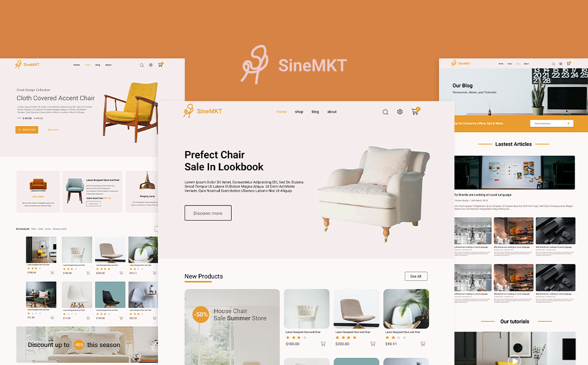

# sineMKT website

---

## Link Figma

<a href="https://www.figma.com/file/jXT7LRVDZ3lf7IZMHcWcH5/sinemkt?node-id=0%3A1" rel="nofollow" target="_blank">Figma SineMKT</a>

## Preview

## Demo site

<a href="" rel="nofollow" target="_blank">Demo</a>

## Author

<a href="https://www.linkedin.com/in/elmahdi-elhjoujy/" target="_blank">ELhjuojy elamhdi</a>

## License

Copyright (c) 2022 brief 2 youcode

Furn is licensed under The MIT License (MIT). Which means that you can use, copy, modify, merge, publish, distribute, sublicense, and/or sell copies of the final products. But you always need to state that ThemeSINE is the original author of this template.
